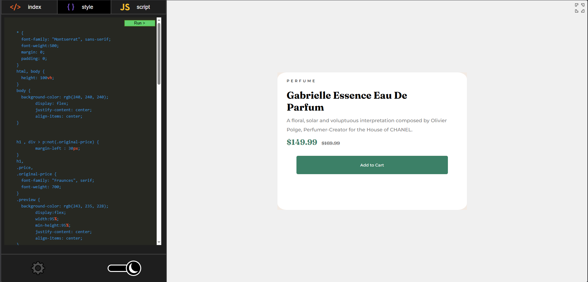

# ✨ Mini Code Editor

A lightweight, browser-based code editor for HTML, CSS, and JavaScript. Write code, see live preview, and enjoy a clean interface with dark/light mode, customizable tab size, and local storage persistence.

  

🔗 **Live Demo:** [https://ahmedmbdr.github.io/mini-code-editor/](https://ahmedmbdr.github.io/mini-code-editor/)

---

## 📸 Screenshot

  
---

## ✨ Features

- **Live Preview** – Run your HTML/CSS/JS code instantly.
- **Basic Syntax Highlighting**
- **Dark / Light Mode**
- **Persistent Storage**
- **Adjustable Tab Size**
- **Maximize / Minimize**
- **Responsive Layout**
- **Custom Icons** – All icons were designed from scratch using **Inkscape**.

---

## 🛠️ Built With

- **HTML5**
- **CSS3**
- **JavaScript**
- **Inkscape** - Icons

---

## 🚀 How to Use

1. Open the [live demo](https://ahmedmbdr.github.io/mini-code-editor/).
2. Click on the **HTML**, **CSS**, or **JS** tabs to switch between languages.
3. Type or paste your code.
4. Click the **Run ▶** button to see the result in the preview panel.
5. Use the **gear icon** to adjust the tab size.
6. Click the **sun/moon slider** to switch between light and dark themes.
7. Click the **maximize/minimize icons** to expand/collapse the code editor.

All your code is saved automatically – refresh the page and it's still there!

---